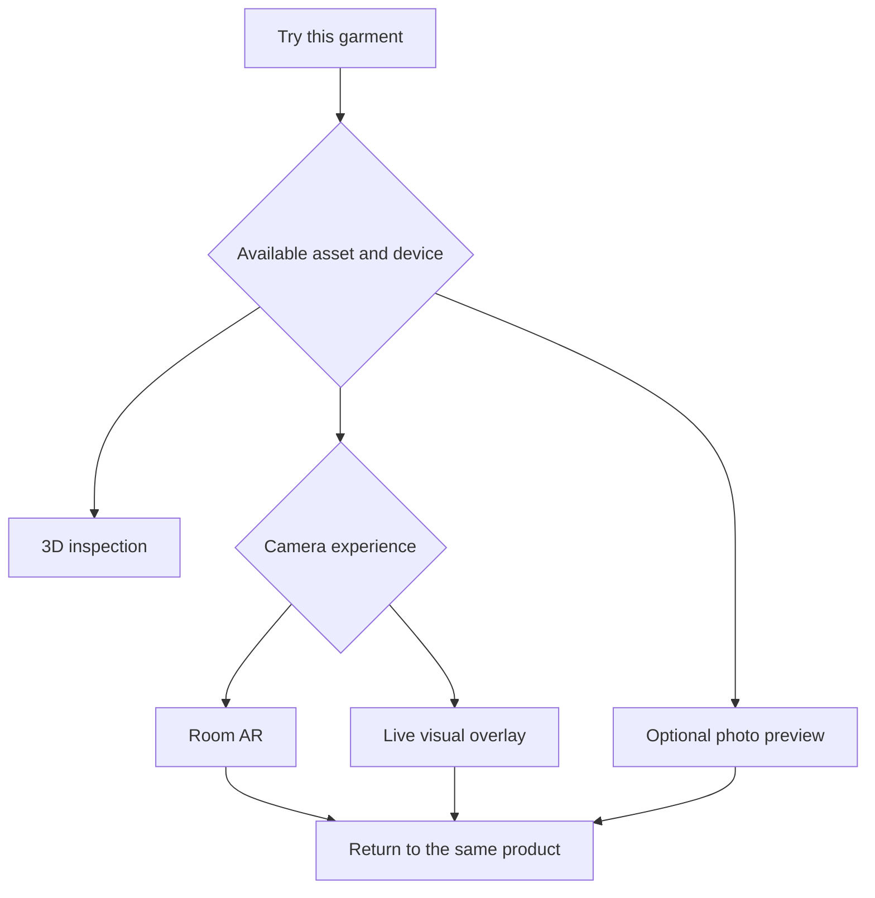

# 02 — Visual system, motion, 3D closets and AR

## 1. Art direction

Build a calm, tactile fashion environment with editorial typography, generous photography and a room that feels worth returning to. The primary expression is warm paper, ink, walnut, limestone, brushed metal and natural light. A restrained iris accent connects the historic Brand.Me identity to interactive controls.

The garment is the visual subject. Interface chrome recedes when inspecting a look or entering the closet. The application must not resemble a cryptocurrency dashboard or a generic grid of glass cards. Spatial depth belongs in the room and object transitions; ordinary forms need stable, legible surfaces.

Use these as executable defaults, not an instruction to copy another brand:

| Token | Light | Dark | Usage |
|---|---|---|---|
| canvas | #F6F3ED | #161817 | Main background |
| surface | #FFFEFA | #222522 | Sheets, forms, inspectors |
| ink | #202720 | #F2F1E9 | Main text |
| muted | #5B635B | #B2B8AF | Secondary text; test contrast |
| line | #D7DBD1 | #41483F | Separators |
| accent | #62527F | #C3B3E6 | Selected controls, focus emphasis |
| forest | #345743 | #92B89C | Success with icon/text |
| amber | #795515 | #E1BD76 | Pending/caution with icon/text |
| error | #A63B39 | #F49C97 | Error text and outlined state |

Never place small white text on a pale accent. Contrast tests decide final pairings. Scene materials have their own physically based values and must not be mistaken for CSS color tokens.

### 1.1 Typography and dimensions

- Display: self-hosted **Cormorant Garamond**, weight 500, with a Georgia fallback. Use for emotional titles and room names.
- UI/body: self-hosted **Manrope**, weights 400/500/600/700, with system sans fallback. Keep its license alongside the font files.
- Data/technical strings: system monospace, only in advanced evidence.
- Mobile body: 16 px / 24 px. Small supporting copy: 13 px / 18 px. Never shrink crucial purchase terms below body size.
- Desktop display: clamp 40–72 px, line height 1.02. Mobile display: clamp 32–44 px.
- Section heading: 24–32 px. Card heading: 18 px / 24 px.
- Spacing: 4, 8, 12, 16, 24, 32, 48, 64, 96 px.
- Radius: controls 10 px; images 14 px; sheets 22 px; full-screen scene 0 px.
- Touch target: at least 44 by 44 CSS px; primary actions 48–52 px high.
- Maximum reading width: 68 characters. Main desktop content width: 1440 px.
- Layer scale: base 0, sticky 10, contextual panel 20, modal 40, toast 50, critical system prompt 60. Do not solve overlap with arbitrary four-digit z-indices.

### 1.2 Responsive composition

| Width | Navigation | Closet | Inspector |
|---|---|---|---|
| 320–599 | 64 px bottom bar plus safe area | Full viewport above controls; filmstrip below | Bottom sheet with 3 snap points |
| 600–1023 | Compact rail or bottom bar based on orientation | Scene and collapsible item panel | 360 px drawer |
| 1024–1439 | 88 px rail | Scene occupies remaining area | 340 px persistent inspector |
| 1440+ | 220 px navigation | Centered scene with breathing room | 380 px inspector |

At 200% zoom, layouts reflow rather than cropping controls. The five-minute timer stays visible when relevant but never obscures the garment. Device keyboard opening must not cover the checkout confirmation or slider numeric input.

## 2. Screen composition contracts

### Today

Top: greeting plus current intention, not a wall of metrics. Main composition: one outfit photographed or rendered against a neutral setting, with a short editorial title such as “A quieter kind of statement.” Under it: actual reasons, **Make it mine**, **Adjust**, **Ask my circle**. Secondary rows: active friend requests, continue an outfit, care reminder. Show no empty social proof.

### Looking Glass

Desktop: garment/outfit preview occupies 55% width, slider group 30%, explanation drawer 15% when open. Mobile: preview above an expandable group of 3 controls; “All preferences” exposes the rest. Visual axis values use a line, endpoints and a numeric value, not personality radar charts. Active edits highlight only changed controls.

### Closet

Top-left: room name with theme menu. Top-right: search, grid/3D toggle, sharing. Lower left: small context label such as “Owned · Work capsule.” Right: selected-item details. Bottom: category/capsule strip and Add item. Keep controls outside the primary object silhouette. A new user sees one deliberately composed starter rail, not a cavernous empty room.

### Product

Large image or 3D object occupies the visual majority. Immediately visible: brand, product title, price with currency/time, chosen variant and capability labels. Main actions are context-dependent: Save to Want, Try, Ask, Shop. Ownership and provenance sit behind a readable details expansion; no green “verified” icon without a named claim and evidence.

### Decision

Two-column comparison when choosing between products; single hero otherwise. Countdown uses text and a restrained ring. Buttons are symmetric **Yes** and **Pass**, with **Suggest an alternative** below. Do not color Yes as morally good and Pass as failure. Vote results use counts and labels, not only color.

### Rewards

Lead with the latest useful contribution: “You helped Maya choose.” Then the earned amount, available balance and benefits. Badges use original SVG artwork with textual criteria. Avoid slot-machine animations, random reward wheels and token-price motifs.

### Ownership

Lead with an item portrait and readable status. A provenance timeline uses issuer, action, date and evidence. Private fields have a clear disclosure control. Transfer/reprint buttons appear only when the member has the corresponding entitlement and the provider is ready.

### Assistant

The conversation is secondary to a structured task card: intention, constraints, selected sources, proposal, approvals, state and receipts. Long-running work remains visible after page reload. Purchase approval appears in a separate deterministic panel, never inside model-generated markdown.

## 3. Motion grammar

All durations are targets. Animation is interrupted by user input and never delays an already available action. Respect operating-system reduced motion and an in-app switch. Do not animate loading forever.

| Interaction | Duration | Motion | Reduced-motion behavior |
|---|---:|---|---|
| Button feedback | 120 ms | Color/opacity; maximum 1 px translation | Color only |
| Context sheet | 240 ms | Translate and fade, easing cubic-bezier(.22,1,.36,1) | 120 ms fade |
| Route content | 180–240 ms | Crossfade; no whole-page slide | Immediate or 100 ms fade |
| Slider preview | 180 ms | Outfit/image crossfade | Immediate update |
| Selected garment | 220 ms | Outline and restrained camera focus | Outline only |
| Room theme | 450 ms | Fade out, replace scene, fade in | Poster swap |
| Badge earned | 650 ms maximum | One gentle scale and light sweep | Static reveal |
| Point credit | 500 ms maximum | Numeric increment after settlement | Final amount directly |
| Error rollback | 180 ms | Return to original place with error label | Immediate return |
| Friend response | 180 ms | New row fade; no layout jump | Instant row |

Use Motion for DOM transitions and Three.js animation/update loops for scene objects. Avoid running competing animation systems on the same property. A single reduced-motion source controls both.

### 3.1 Signature garment-to-closet interaction

This is a required acceptance scenario, not an optional flourish.

1. User presses **Add to closet** from a product, intake review, or owned-item confirmation.
2. Choose status and destination in a compact sheet. Default to Want for catalog discoveries and Owned only after explicit declaration/purchase evidence.
3. Resolve the destination slot and prefetch the low-detail asset. If no 3D garment exists, show the honest photo-display representation.
4. Send the idempotent wardrobe command. Display a pending placeholder in the destination.
5. On success, run a 900 ms sequence:
   - 0–120 ms: source image lifts by 4 px and gains a soft shadow.
   - 120–300 ms: source fades into a garment representation in a small transition overlay.
   - 300–680 ms: the object follows a cubic Bézier path into its closet slot. Keep its material and silhouette visible.
   - 680–820 ms: hanger settles with at most 3 degrees of damped rotation.
   - 820–900 ms: a fine placement highlight fades and the item becomes selectable.
6. Announce “Added to your Work rail” to assistive technology. Show **Undo** for 10 seconds, implemented as an actual inverse wardrobe command.

If acknowledgment takes more than 600 ms, keep a pending representation with “Saving.” Do not wait indefinitely to move into the closet view. The final settled state is driven by the authoritative response. If the app is backgrounded, restore the completed placement without replaying the full animation.

The same interaction must work by button and keyboard; dragging is an enhancement. Dragging a catalog image directly over the closet opens the same destination/status confirmation.

## 4. Closet scene specification

### 4.1 Technical baseline

Use React Three Fiber v9 with a compatible React 19 release and Three.js, subject to the pinned compatibility check in chapter 06. Keep the renderer in a lazily loaded client island. Start with WebGL2 for the broad baseline; WebGPU is an optional measured enhancement, not a launch prerequisite. Official R3F documentation distinguishes the stable v9 line from v10 preview documentation [S08].

Scene units are meters. Right-handed coordinate system: +Y up, +X right, -Z forward. Author GLB assets consistently; convert imported source conventions in the asset pipeline, not by random per-instance rotations.

Camera default: perspective 38-degree vertical field of view, near 0.05 m, far 40 m; position [0,1.55,4.8], target [0,1.35,0]. Limit orbit yaw to ±55 degrees, pitch to -12/+18 degrees relative to default, and dolly to 1.4–6 m. Provide named views rather than requiring game-like movement.

### 4.2 Three initial rooms

| Environment | Dimensions | Materials and light | Functional anchors |
|---|---|---|---|
| Walnut Atelier | 4.8 W × 3.6 D × 2.8 H m | Warm walnut, cream plaster, aged brass; soft 4300 K side light | 2 rails, 4 shelves, 2 drawers, central outfit stand |
| Limestone Gallery | 5.2 × 4.0 × 3.0 m | Limestone, pale oak, brushed steel; diffuse 5500 K light | 3 modular bays, shoe plinths, full-height mirror surface |
| Garden Studio | 4.6 × 3.8 × 2.8 m | Ash wood, muted green, linen; indirect daylight and restrained plants | Rail, folded-item wall, accessory tray, capsule bench |

Rooms use original geometry and owned/appropriately licensed textures. Do not copy a hotel, retailer interior or reference photograph into commercial assets without rights. The room is aspirational but uncluttered; decorative objects are outside the interaction path and count toward performance budgets.

For Walnut Atelier, define these stable slot groups:

- `rail.left`: center [-1.45,1.75,-0.65], usable width 1.45 m, hanger pitch 0.12 m.
- `rail.right`: center [1.45,1.75,-0.65], same width/pitch.
- `shelf.shoes`: center [0,0.24,-1.15], 8 semantic slots.
- `shelf.folded`: center [0,1.05,-1.15], 6 slots.
- `tray.accessories`: center [1.45,0.85,0.4], 6 slots.
- `stand.outfit`: center [0,0,-0.1], one composite outfit.

Each room manifest maps semantic groups to transforms. The exact number of visible slots is a presentation limit, not a paid limit on owned data. Overflow opens a paginated capsule or drawer.

### 4.3 Materials and lighting

Use physically based materials with roughness maps and restrained normal detail. Avoid universal metallic settings on fabric. Set texture color spaces correctly: base color/emissive as color data, normal/roughness/metalness as linear data. A fabric's original color should remain recognizable across themes.

Bake ambient occlusion and most room lighting. Use one primary dynamic shadow light on high quality; lower tiers use contact-shadow approximation or baked grounding. Mirrors use an intentionally limited reflection solution with explicit quality tiers; no expensive full-scene real-time reflection on entry mobile devices.

Preserve original asset material values and provide a neutral-light inspection mode. Room mood lighting must not mislead the user about a product's actual color.

### 4.4 Interaction model

- Tap/click a garment: select and open item inspector.
- Second deliberate action: inspect in isolated turntable view.
- Drag: lift item, show eligible semantic destinations, snap on release.
- Long press on touch: enter placement mode after 350 ms; moving before that scrolls normally.
- Escape: cancel placement and restore last acknowledged transform.
- Arrow keys in placement mode: move between named slots; Enter confirms.
- Search: dim nonmatching visible objects and show results in an accessible list; do not hide keyboard focus.
- Multi-select: use the 2D tray, then move a group to a capsule. Avoid complex multi-object 3D manipulation on phones.
- Pinch/scroll: camera zoom within bounds; never trap page scrolling outside the scene.
- Room view is a toggle, not a mandatory interaction for core account tasks.

Persist placement only on commit, not on every animation frame. Debounce camera preference persistence to 1 second idle and treat camera position as device-local unless the user saves a named view.

### 4.5 Placement contract

A placement includes wardrobeItemId, roomId, semanticGroup, slotId, positionMeters, rotationQuaternion, uniformScale, assetRevision and version. Scale is clamped to asset-specific display bounds. Physical AR uses calibrated real dimensions separately.

Two clients moving the same item submit expected versions. A conflict returns the current placement and lets the member choose which to keep. Do not silently use last-write-wins for an item simultaneously transferred or deleted.

Moving from Owned to Want is a domain action, not a scene transform. A decorative placement cannot modify ownership. Theme remapping is deterministic; any item lacking a corresponding group moves to an “Unplaced” tray and remains accessible.

## 5. 3D garment asset pipeline

### 5.1 Fidelity classes

| Class | What it really is | Allowed uses | Required label |
|---|---|---|---|
| P0 | Product photograph on a framed/billboard surface | Closet organization, sharing | Photo display |
| P1 | Category proxy mesh with permitted product image/material | Approximate wardrobe composition | Approximate 3D |
| P2 | Product-specific authored/scanned 3D asset | Turntable, room placement, outfits | Product 3D model |
| P3 | Rigged product-specific garment with validated binding | Body-following visual preview | Live visual preview |
| P4 | Calibrated pattern/material/body model with validated fit pipeline | Fit simulation under tested conditions | Fit estimate with method and limits |

Do not promote P0/P1 into P3 through a UI label. Generative image-to-3D can propose an asset, but it enters the same QA and rights pipeline. A generated back side is inferred, not authenticated product detail.

### 5.2 Pipeline stages

`uploaded → quarantined → validated → normalized → optimized → reviewed → published`, with rejected and superseded branches.

Validate MIME by content, decompressed size, mesh/texture counts, external references, bounds, orientation, licensing and product linkage. Reject executable attachments, unapproved remote texture URLs, zip bombs and nonfinite transforms. Strip author metadata that contains personal information.

Normalize dimensions and origin. For hanging clothing, the pivot is the hanger hook. For folded items/shoes, the pivot is the grounded center. Generate:

- canonical source archive stored privately;
- high-detail GLB for product inspection;
- medium and low GLB/LOD variants for closet scenes;
- KTX2/Basis textures where supported;
- a compatible uncompressed fallback for decoders that fail;
- USDZ for tested Quick Look behavior;
- transparent product poster and neutral turntable stills;
- collision bounds, category slots and rig metadata;
- manifest with hashes, dimensions, licenses, author, source product revision and QA result.

glTF is the interchange format; texture/geometry compression choices must be supported by the actual loaders [S09]. Retain immutable asset revisions and separate user scene placement from product asset revisions.

### 5.3 Performance budgets

| Budget | Entry mobile | Standard mobile | Desktop |
|---|---:|---:|---:|
| Visible detailed garments | 12 | 24 | 48 |
| Scene draw calls | 100 | 150 | 250 |
| Visible triangles | 180k | 350k | 800k |
| Approximate GPU texture budget | 96 MB | 160 MB | 384 MB |
| Dynamic shadow lights | 0 | 1 | 1 |
| Device pixel ratio ceiling | 1.0 | 1.5 | 2.0 |
| Active target frame rate | 30 fps | 45–60 fps | 60 fps |
| First useful closet payload | ≤4 MB compressed | ≤6 MB | ≤8 MB |

These are initial acceptance budgets. Measure on representative real devices and lower complexity before raising limits. Do not let a single garment consume the entire budget. Individual low/medium garment GLBs target ≤750 KB/2 MB, with texture reuse when permitted.

Use instancing for repeated hangers/shelves, shared materials, bounded asset caches, demand rendering when idle, LOD, frustum culling and disposal on route exit. Suspend rendering when backgrounded or occluded. Avoid React state updates inside every frame. Official R3F performance guidance supports demand rendering and reuse [S10].

Quality selection uses capability tests and measured frame time. Downgrade after sustained frame times above 40 ms; upgrade only after a stable interval to avoid oscillation. A WebGL context loss offers restore, then immediately available 2D mode.

### 5.4 Initial fixture assets

Claude must supply actual files for three rooms and at least six original fictional garments: neutral tee, tailored jacket, relaxed trouser, fluid dress, knit layer and sneaker pair. Each needs an asset manifest, real thumbnail and appropriate fidelity class. Procedural original meshes are acceptable for the demo if they look intentional and are labeled approximate. Empty boxes, broken image paths and borrowed luxury-brand renders are not acceptable.

The demo must include an item without 3D data so the fallback is exercised. Do not wait for every retailer to provide a production GLB before delivering the closet.

## 6. AR and try-on capability ladder

Treat these as separate product capabilities:

1. **3D inspection:** rotate/zoom an object without camera access.
2. **Room AR:** place the garment/mannequin or closet object in physical space.
3. **Live visual overlay:** follow a person's pose with an approximate representation.
4. **Photo try-on:** generate a still image from a person photo and product image.
5. **Calibrated fit:** a separately validated measurement/material workflow.

Use a capability chooser that explains the result before asking for permissions.

### 6.1 Room AR

Use a `model-viewer` adapter with explicitly tested WebXR, Scene Viewer and Quick Look paths. The official examples document the three modes, HTTPS requirement and the fact that custom browser DOM does not carry into native Scene Viewer/Quick Look [S11]. Therefore:

- Save the product/variant/context before launching a native viewer.
- Keep purchase approval in the normal trusted app surface after return.
- Supply explicit USDZ where required fidelity/animation is not preserved by conversion.
- Use calibrated dimensions and fixed physical scale when known; otherwise label scale as approximate.
- Show a floor-finding instruction and a cancel action.
- Never claim room placement is body try-on.

### 6.2 Live visual overlay

Implement a local pose pipeline using MediaPipe Pose Landmarker in a worker when browser support permits. The documented web package is `@mediapipe/tasks-vision`; use locally hosted, versioned model assets [S12]. Maintain a 15–30 Hz inference loop and render interpolation separately.

Session states: not_started, permission_requested, calibrating, tracking, low_confidence, lost, stopped, unsupported. Use capability and permission checks before loading expensive models.

Initial scope: front-facing upper-body visual preview with a rigged garment or clearly labeled overlay. Derive anchor position/rotation/scale from normalized landmarks, smooth using a One Euro or exponential filter, and clamp extreme changes. Confidence thresholds are configurable and evaluated on varied bodies, clothing, lighting and mobility. Do not infer precise body dimensions from a single uncalibrated camera.

Occlusion is a separate segmentation pass. If it cannot run, communicate reduced fidelity rather than drawing clothing through arms while claiming realistic fit. Freeze/fade the garment when tracking is lost. Do not keep running a camera after navigation or app backgrounding.

By default, camera frames and pose landmarks never leave the device or enter analytics. Capturing a share image requires a separate button and preview. No eye/gaze telemetry is needed for the web launch despite legacy biometric-sync fields.

### 6.3 Photo try-on

Implement a provider interface with a first candidate of Google's documented Virtual Try-On model, subject to account, region and permitted-use availability. The current documentation identifies `virtual-try-on-001` and accepts person/product image inputs [S13]. This is an image-generation service, not a garment-fit certification.

Flow: select an owned/rightfully usable person photo; crop/review; choose product image; read the provider disclosure; explicitly send; show queued/running/completed/failed; compare original and generated; save or discard. Never silently upload a live camera stream to this provider.

Default raw upload expiry is 24 hours, with earlier deletion after processing where practical. Unsaved generated results expire after 24 hours. Saved outputs remain until the user deletes them. Provider retention may differ and must be displayed from the approved provider contract; do not promise control over a provider that has not agreed to it.

The backend uses a private object-store URI or encrypted temporary transfer, never a public photo URL. Jobs have cancellation and spend limits. A rejection or unsuitable result returns a useful explanation and preserves the source item. Failed jobs do not appear as purchases or consume loyalty benefits.

### 6.4 Native extensions

A native iOS/Android companion can improve body tracking and wallet support after the web experience is complete. Its contract shares domain APIs, asset manifests, identity controls and capability states. Native body tracking uses supported platform APIs with a device matrix, not a claim that every browser supports ARKit.

Do not choose a discontinued or unverified AR SaaS because an old Brand.Me plan named it. Provider activation requires current documentation, a working SDK, rights review and a real device test.

## 7. Accessibility and sensory control

Every scene object has a corresponding DOM row with name, status, position and actions. Screen-reader users can add, organize, inspect, style, share and transfer items without operating the canvas. Focus must never be trapped inside WebGL.

Controls include reduced motion, simple view, high contrast, captions for instructional media, and sound off by default. Haptics are optional enhancements. Color cannot be the only vote, trust or sync indicator.

Offer exact text alternatives for spatial actions: “Move linen shirt to Work rail, slot 3.” Announce save success and errors once. Do not announce every animation frame or countdown second; announce decision time at sensible milestones.

## 8. Visual QA contract

Capture named screenshots at 390×844, 768×1024 and 1440×900 for onboarding reveal, Looking Glass edit, each closet theme, product details, a live decision, rewards, purchase confirmation and ownership. Capture reduced motion and no-WebGL variants.

Record a short video of garment placement and compare it to the specified timeline. Verify no clipping, floating garments, duplicated shadows, text inside camera feed, unsafe contrast, blank assets or layout jumps. Test real touch input and keyboard navigation in addition to automated browser tests.

Screenshot approval validates appearance; domain tests validate truth. A beautiful green badge must still fail review if its proof is a stub.
