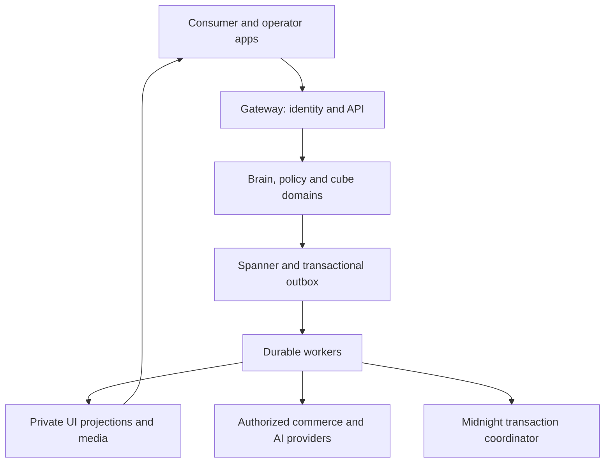

# 03 — Architecture, data and API contract

This chapter defines the target implementation. Existing code must be migrated into it deliberately. A file named below as **new** does not exist at the audited baseline.

## 1. Architectural decisions

1. Keep this repository. The consumer application lives in `brandme-frontend`; the operator console stays in `brandme-console`. Do not create a disconnected starter application beside them.
2. Upgrade the consumer to a supported stable Next.js 16.3 release and compatible React 19 release after resolving exact patched versions against official release/package metadata. Record the complete tested tuple in `docs/build/compatibility-lock.md` and the package lock. Do not install a canary merely because its version number is larger. The baseline is Next 14/React 18, so this is a migration with hydration and routing checks.
3. Use Server Components for the initial page and authorized reads. Keep persona controls, optimistic mutations, motion, the 3D canvas, camera and wallet code in small Client Component islands. Never serialize a server secret into component props. [S24]
4. Keep the TypeScript gateway as the public domain API and identity boundary. Reuse Python/FastAPI domain services and `brandme_core`. The Next server may act as a thin same-origin BFF; it must not independently award rewards, settle commerce, or mutate ownership.
5. Keep Google Cloud Spanner as the authoritative application database. Introduce versioned GoogleSQL migrations, not a second canonical PostgreSQL database. Firestore is a replaceable, access-controlled projection for timely UI updates. Object storage holds media and export packages.
6. Implement new consumer domains as modules inside the existing brain service and shared library first. Keep cube, policy and chain boundaries where they enforce useful ownership/security separation. A social vote does not need its own deployment.
7. Use a transactional outbox for asynchronous work. The target cloud deployment uses Cloud Tasks for directed retryable work and Pub/Sub for fan-out. Existing NATS JetStream supports the local/legacy adapter during migration. One environment selects one delivery adapter per event; consumers deduplicate across migration. Do not operate two competing event authorities.
8. Run ordinary stateless HTTP services and event handlers on Cloud Run initially. Run prover and other stateful/long-running workloads on separately provisioned infrastructure appropriate to their resource and privacy needs. Preserve existing GKE manifests as an alternative operational deployment, not the default prerequisite to show the product.
9. Select OIDC through Google Identity Platform for initial managed account sessions. Hide it behind an identity adapter. Support email link and configured social providers; introduce passkeys only through a verified supported provider/implementation. Do not build password handling casually.
10. Use an explainable deterministic ranking system before introducing an LLM. Models help label authorized data, suggest combinations and write explanations from supplied reasons. They do not decide permissions, own financial arithmetic, invent catalog availability, or verify proofs.

Spanner and production proving carry operating costs. This design preserves existing investment and consistency requirements; it is not a claim that the infrastructure is free or appropriate at every future scale.

## 2. Runtime boundaries



The diagram does not imply the server holds every Midnight secret. User private state and witness handling follow chapter 04. Browser wallet transactions return through the coordinator for reconciliation.

### Target repository map

| Path | Responsibility and migration |
|---|---|
| `brandme-frontend/app/(public)` | New editorial introduction, public sanitized shares, sign-in and permission-independent try-demo |
| `brandme-frontend/app/(member)` | New Today, Me, closet, outfit, circle, discovery, assistant, rewards and data routes |
| `brandme-frontend/features/{persona,closet,outfits,social,rewards,commerce,ownership,privacy}` | New domain UI; components, client hooks, accessibility and feature tests |
| `brandme-frontend/features/spatial` | Canvas, room manifests, picking, placement, AR adapters and quality governor |
| `brandme-frontend/lib/server` | Server-only session, API client and authorized data loaders |
| `brandme-frontend/lib/client` | Query cache, online status, safe local drafts, telemetry consent |
| `brandme-frontend/public/demo` | Licensed fictional room/garment assets and manifests; no retailer assets without permission |
| `packages/contracts` | New generated TypeScript types, JSON schemas and OpenAPI artifacts; source of API vocabulary |
| `packages/design-system` | New tokens, accessible primitives, icons and visual examples shared with console |
| `packages/provider-contracts` | New provider capabilities and adapter interfaces without secrets or SDK side effects |
| `brandme-gateway/src/routes/v1` | Public REST surface and middleware; legacy routes kept through documented adapters |
| `brandme_core/domains` | New persona, wardrobe, social, reward, commerce, rights, privacy and provider modules |
| `brandme_core/events` | New outbox writer, dispatcher, inbox dedupe, event schemas and projection reducers |
| `brandme-core/brain` | Mount new consumer routers and dependency injection; reuse established service entrypoint |
| `brandme-cube/src` | Versioned, policy-filtered Product Cube reads and authenticated lifecycle commands |
| `brandme-chain/src` | Real Midnight adapter, contract integration and transaction observations; separate Cardano adapter |
| `brandme-chain/contracts` | New Compact source, generated bindings, circuit artifacts manifest and contract tests |
| `brandme-data/spanner/migrations` | New ordered GoogleSQL migrations and migration ledger |
| `brandme-console` | Provider setup, rights issuer approvals, jobs, disputes, moderation and operations |
| `tests/e2e`, `tests/contracts`, `tests/security` | New cross-service journey and boundary checks |
| `docs/build` | New execution checklist, compatibility lock, evidence, deviations and operator runbooks |

Add the frontend and new packages to `pnpm-workspace.yaml`. Pick a supported Node LTS compatible with every resolved dependency and pin it in the toolchain files and CI. Resolve the package manager version once; update the lockfile in a dedicated stage. Do not mix independent `npm`, `yarn` and `pnpm` lockfiles. Keep Python dependencies reproducible and record runtime versions.

### Frontend state boundaries

- Server data: typed fetchers plus a single query cache library, TanStack Query as the proposed default. Query keys include identity/tenant, environment and entity revision. Clear protected caches on sign-out/account switch.
- URL state: search, catalog filters, closet collection and selected public tab. Never put body measurements, tokens, raw persona vectors or private addresses in a URL.
- Local transient state: drag coordinates, hover, open drawers, current animation and unsubmitted drafts. Use React state; a small Zustand store is acceptable for scene-local coordination.
- Persistent domain state: API only. Local storage is not the canonical wardrobe, persona, rewards ledger or approval store.
- Private IndexedDB: scoped account drafts and explicitly supported encrypted wallet state. Do not conflate these stores or reuse encryption keys.
- A server mutation returns authoritative state and revision. An optimistic UI always knows how to roll back and announce failure.

## 3. Identity and authorization

Every authenticated request resolves a `Principal`: internal member ID, authenticated subject, session ID, authorized client ID, scopes, assurance level, environment and optionally delegation ID. `user_id` in a tool argument is never an authentication mechanism. Map external OIDC subject plus issuer to an internal ID; do not use email as the primary key.

Consumer sessions use secure, HTTP-only, same-site cookies. Enforce CSRF protection and origin checks on state changes. External MCP/agent clients use short-lived audience-bound access tokens. Verify issuer, audience, expiry, algorithm allowlist and key rotation through the identity provider. Browser-held retailer or service credentials are prohibited. Operator roles require stronger authentication and explicit scoped role assignments.

Authorization is evaluated against both action and fields. The basic rule is deny unless owner, a valid share grant, a relevant friendship grant, or an explicit operational role permits access. Blocking overrides ordinary social sharing. Support access uses an audited, time-bounded reason and may not expose private body imagery or wallet secrets. An operator cannot edit a points balance directly; an authorized correction is a ledger event with reason and evidence.

### Minimum scopes

| Scope | Permitted action |
|---|---|
| `profile:read`, `profile:write` | Read permitted profile; change own preferences through validation |
| `wardrobe:read`, `wardrobe:write` | Read permitted items; create/update own collections and placements |
| `outfits:read`, `outfits:write` | Read or fork permitted outfits; edit own versions |
| `social:read`, `social:write` | Act within own relationships and invitation grants |
| `rewards:read` | Read own balance and entries; no consumer award scope |
| `commerce:research`, `commerce:cart` | Search and construct draft carts within the delegation |
| `commerce:purchase` | Request purchase only with valid bound approval/mandate |
| `rights:read`, `rights:transfer`, `rights:reprint` | Request rights workflows; ownership proof and policy still required |
| `privacy:manage` | Export/delete/correct own data after required reauthentication |
| `provider:admin`, `moderation:admin` | Separate console-only operator authority |

Scopes are necessary but not sufficient. A stolen token with `rights:transfer` cannot satisfy a wallet proof. A checkout scope cannot bypass merchant, amount, expiry, payee or variant constraints.

## 4. Data dictionary and authority

Use UUID identifiers for internal entities and opaque stable external references. All rows carry creation/update times and environment where relevant. Mutable aggregates carry `version INT64`. API revisions are decimal strings if they may exceed JavaScript's safe integer range. Store times in UTC; render local time with explicit zone. Monetary values are signed/unsigned integer minor units according to operation, paired with ISO currency and the correct currency exponent; never binary floating point. JSON transport uses decimal strings for money and counters that may exceed safe integers.

### Identity and persona

| Entity | Minimum fields | Authority |
|---|---|---|
| `Member` | id, identity_subject_ref, handle, display_name, locale, timezone, age_eligibility_status, account_state, version | Member edits approved fields; identity provider owns authentication |
| `MemberSettings` | member_id, room_theme, motion_mode, quality_mode, notification_preferences, default_visibility, version | Member |
| `PersonaProfile` | member_id, schema_version, declared_axes, inferred_axes, locked_axes, effective_axes, goals, exclusions, budget, learning_enabled, version | Member declarations override allowed inference |
| `PersonaEvidence` | id, member_id, source_type, source_ref, purpose, consent_id, axis_contributions, model_version, observed_at, expires_at, suppression_state | Inference worker with lineage, member can inspect/remove |
| `PersonaSnapshot` | id, member_id, profile_version, redacted_summary, axes_snapshot, saved_name, created_at | Member-owned history; revocable shares use filtered copy |
| `ConsentGrant` | id, subject, purpose, data_categories, grantee, scope, valid_until, state, revision | Member grants/revokes; policy enforces |
| `BodyProfile` | id, member_id, encrypted_measurements_ref, units, source, confidence, consent_id, updated_at | Private member vault; never a public persona field |

Store independent axis objects rather than only the two legacy user columns. Backfill the two existing dimensions where valid; mark all other dimensions unknown or user-set. Unknown is not zero or a fabricated confident midpoint. API DTOs may render an uncommitted neutral visual position with an “unanswered” state.

### Catalog, wardrobe and social

| Entity | Minimum fields | Authority |
|---|---|---|
| `CatalogProduct` | id, merchant_ref, source_product_id, brand, title, category, attributes, source_revision, rights_policy_ref | Authorized provider; member corrections are proposals |
| `ProductVariant` | id, product_id, source_variant_id, size_system, size_label, color, measurements_ref, availability, checked_at | Merchant/source |
| `ProductOffer` | id, variant_id, provider, amount, currency, country, deep_link, valid_until, source_timestamp | Provider quote, not a promise beyond validity |
| `MediaAsset` | id, owner_or_licensor, source, rights, fidelity, safety_state, derivatives_manifest, content_hash, visibility | Uploader/rights holder plus processing service |
| `WardrobeItem` | id, member_id, product_id optional, asset_instance_id optional, title, collection, acquisition_source, condition, care_state, user_notes, version | Member closet record; claim strength separately derived |
| `AssetInstance` | id, issuer_id optional, product_id, serial_commitment optional, authenticity_status, passport_id, lifecycle_state, version | Verified issuer/lifecycle authorities for attested fields |
| `ClosetLayout` | id, member_id, room_template_id, room_version, version | Member |
| `ClosetPlacement` | item_id, layout_id, anchor_group, slot_id, position, quaternion, scale, version | Member with spatial bounds validation |
| `Outfit` / `OutfitVersion` | owner, title, visibility; immutable version item_refs, layer order, occasion, notes, author | Owner; collaborators propose new versions |
| `Relationship` | member_pair, requested_by, state, created_at, accepted_at | Both participants for friendship; either for block |
| `Decision` | creator, item_or_outfit_ref, prompt, audience_snapshot, closes_at, state, version | Creator within timing and editing rules |
| `DecisionResponse` | decision_id, respondent_id, choice, alternative_ref, note, submitted_at, revision | Respondent; server enforces deadline and uniqueness |
| `ShareGrant` | owner, entity_ref, allowed_fields, audience, token_hash, expires_at, revoked_at | Owner; default least disclosure |
| `Notification` | member_id, event_id, type, sanitized_payload, read_at | Domain events; deduplicated by recipient/event/type |

A `CatalogProduct` is a style or product definition. An `AssetInstance` is an individual attested item. A `WardrobeItem` is someone's relationship to a possession or aspiration. Do not overload the existing `Assets` table with every search result. One product can correspond to many physical instances; a wishlist entry has no ownership proof merely because it references that product.

### Trust, rewards and commerce

| Entity | Minimum fields | Authority |
|---|---|---|
| `RewardAccount` | member_id, available, reserved, lifetime_earned, revision | Ledger reducer only |
| `RewardEntry` | id, member_id, cause_event_id, rule_version, signed_points, state, reverses_entry_id, created_at | Reward worker within transactional uniqueness |
| `BadgeAward` | member_id, badge_id, criteria_version, evidence_refs, awarded_at, revoked_at | Rules engine; earned evidence visible to owner |
| `BenefitReservation` | id, member_id, cost, benefit_ref, state, expires_at | Transactional reservation service |
| `ShoppingIntent` | id, member_id, structured_goal, exclusions, budget, permitted_merchants, assistance_mode, expires_at | Member instructions, not itself a payment authorization |
| `AgentDelegation` | id, member_id, client_id, scopes, limits, allowed_providers, expires_at, revoked_at | Member through trusted UI |
| `Cart` / `CartLine` | member, merchant, provider_cart_ref, revision, status; variant, quantity, price_snapshot | Commerce service synchronized with provider |
| `CheckoutQuote` | id, cart_revision, lines, subtotal, tax, shipping, discounts, total, currency, payee, delivery, terms_hash, quote_hash, expires_at | Fresh provider result normalized deterministically |
| `PurchaseApproval` | id, principal, delegation_ref, quote_hash, allowed_total, nonce, issued_at, expires_at, state | Trusted approval surface; cryptographic provider binding where supported |
| `Order` | id, member, merchant, provider_order_ref, quote_hash, idempotency_key, status, payment_status, last_observed_at | Merchant/payment observations, not agent prose |
| `ReturnRequest` / `Refund` | order_line, quantity, provider_ref, status; amount, currency, observed_at | Provider or documented manual evidence |
| `OwnershipClaim` | asset_id, claimant_ref, evidence_kind, issuer, assurance, verified_at, expires_at | Named issuer and verifier |
| `TransferIntent` | asset_id, from_subject, recipient_commitment, rights_scope, expected_epoch, state, expires_at | Current authorized controller plus recipient acceptance |
| `LicenseGrant` | id, asset_or_design_ref, issuer, controller_commitment, permissions, territory, quota, validity, revocation_policy | Rights holder and verified contract |
| `ReprintJob` | license_id, manufacturer, design_digest, material_spec_ref, quantity, nullifier, state, result_asset_ids | Entitlement plus manufacturer attestations |
| `ChainOperation` | id, network, contract_ref, circuit, request_digest, state, tx_id optional, observed_block, finality_policy, error | Real wallet/node/indexer observations |
| `Attestation` | issuer, schema, subject_commitment, claims_digest, evidence_ref, issued_at, expires_at, revocation_ref | Issuer; trust registry decides which claims count |

### Infrastructure and privacy entities

`OutboxEvent`, `InboxReceipt`, `IdempotencyRecord`, `ProviderConnection`, `ProviderCredentialRef`, `IngestionCursor`, `WebhookReceipt`, `ProjectionCursor`, `ExportJob`, `DeletionJob`, `DataCorrectionRequest`, `AuditEntry`, `ModerationCase`, `FeatureFlag` and `OperationBudget` must be explicit tables or aggregate-owned records. Their states must be observable in the console. A successful HTTP response alone is not an audit trail.

### Schema rules

- Put schema version and migration checksum in a migration ledger. A deployment refuses to run against an unsupported schema range.
- Write actual Spanner GoogleSQL DDL and run it against the emulator and an authorized disposable cloud database where emulator limitations matter. Do not copy PostgreSQL `JSONB`, partial-index syntax, extensions or foreign-key behavior without verification.
- Use interleaving only when child primary-key prefixes correctly include the parent key. Avoid unbounded interleaved histories if deleting a parent would erase required financial records.
- Enforce uniqueness with deterministic primary keys or supported unique indexes: response `(decision_id, respondent_id)`, reward cause `(member_id, rule_version, cause_event_id)`, webhook `(provider, event_id)`, idempotency `(principal, environment, operation, key)`.
- Add query-specific indexes: wardrobe by member/collection/update time; decisions by recipient/state/close time; catalog by source/product/variant; orders by member/created time and provider/order reference; outbox by shard/status/next attempt; chain operations by network/state/next check.
- Prevent write hot spots with distributed IDs and bounded sharded queues where required. Do not lead a high-volume primary key solely with an increasing timestamp.
- Backfill with checkpoints, row counts and resumable batches. Keep old fields read-compatible during migration; remove them only after callers and data have moved.

## 5. Commands, events and consistency

A domain command authenticates, loads the relevant version, checks policy and invariants, and commits domain rows plus outbox events in one Spanner read/write transaction. Spanner transaction callbacks can retry; they must not call a merchant, award an external voucher, upload a blob, invoke a model, or broadcast a blockchain transaction. [S25]

The outbox dispatcher claims a bounded lease, delivers using a stable event ID, and records delivery. Delivery is at least once. A consumer transaction records its inbox receipt with its state change. If the process dies after remote success but before acknowledging, the same provider idempotency key or reconciliation query is used. No component promises distributed exactly-once execution.

### Event envelope

Required: `event_id`, `event_type`, `schema_version`, `aggregate_type`, `aggregate_id`, `aggregate_version`, `occurred_at`, `environment`, `actor_ref`, `correlation_id`, `causation_id`, `privacy_class`, `payload`. Payload uses internal references and minimal data, never raw camera frames, seed phrases, payment credentials, unrestricted addresses or an entire persona. Sensitive references resolve only in authorized workers.

Events include `persona.updated`, `persona.evidence.suppressed`, `wardrobe.item.created`, `closet.placement.changed`, `outfit.version.created`, `decision.opened`, `decision.responded`, `decision.closed`, `reward.posted`, `reward.reversed`, `share.revoked`, `consent.revoked`, `commerce.quote.ready`, `commerce.purchase.authorized`, `commerce.order.observed`, `ownership.transfer.requested`, `chain.operation.observed`, `license.issued`, `reprint.attested`, `privacy.deletion.requested` and `privacy.deletion.completed`.

Use three retry lanes: quick transient recovery with exponential jitter; slower provider/chain observation; terminal dead letter with operator reason. Retry limits are per operation and never extend an expired purchase authorization. A dead-letter retry runs current authorization/policy again. Alert on age as well as count.

### Cross-device projection rules

Each Firestore document contains only the fields that the intended subscriber may see, plus source aggregate version. Partition member-private documents under their member ID; use explicit narrowly filtered shared projections for friend/public views. Security rules deny unauthorized reads and client writes to trusted projections. Server SDKs also require service IAM and application checks; rules are not a substitute for server authorization. [S26]

Subscribers ignore older revisions. A version gap or unknown event triggers a fresh API read. Revocation deletes shared projections and invalidates tokens/caches; it is not merely a hidden button. Do not project `owner_id`, private ownership history or body data into public cube documents. Target ordinary UI projection freshness under two seconds p95 at release load; display a syncing state beyond five seconds, then poll/back off. These are targets to measure, not existing guarantees.

## 6. Public API behavior

Base path is `/api/v1`. Publish OpenAPI 3.1, generate TypeScript and Python-compatible schema checks, and version incompatible contracts explicitly. Every JSON response has request ID and environment in headers. All mutations require authenticated identity unless specifically designated guest intake. Errors use `application/problem+json`: `type`, `title`, `status`, `code`, `detail`, `instance`, `request_id`, `retryable`, and field errors where safe. Never send stack traces or secret-bearing provider response bodies.

Collection endpoints use opaque cursor pagination, default 24/max 100, stable tie-breaking and bounded filters. User-specific responses are private/no-store unless a carefully scoped server cache is used. Public cache keys include visibility and revision. Do not use global `force-cache` for authenticated profiles.

### Endpoint inventory

| Method and path | Contract and important result |
|---|---|
| `GET /me` | Current member, settings, onboarding state and capability summary |
| `PATCH /me` | Allowlisted profile fields with `If-Match`; returns new revision |
| `GET /me/persona` | Declared/inferred/effective values, locks and source summaries |
| `PATCH /me/persona` | Axis edits, locks, goals, exclusions; `If-Match`; inference cannot overwrite locks |
| `POST /me/persona/preview` | Read-only ranking preview for submitted draft; returns request revision |
| `GET /me/persona/evidence` | Own evidence with origin, purpose and contribution |
| `POST /me/persona/evidence/{id}/suppress` | Remove contribution, prevent reuse, queue recomputation |
| `POST /me/persona/reset` | Explicit scope: inference, declarations or entire profile; confirmation and revision |
| `POST /me/persona/snapshots` | Save named private snapshot |
| `GET /recommendations` | Reasons, exclusions honored, source freshness and sponsorship markers |
| `POST /recommendations/{id}/feedback` | Interested/not-me/why; purpose-limited evidence event |
| `GET /catalog/search` | Authorized provider aggregation; freshness and exact variant references |
| `GET /catalog/products/{id}` | Product, offers, asset fidelity and supported capabilities |
| `POST /media/uploads` | Create short-lived constrained upload URL and processing job |
| `GET /media/jobs/{id}` | Authorized processing status, not an unrestricted bucket URL |
| `GET /wardrobe/items` | Own or explicitly granted closet view with field filtering |
| `POST /wardrobe/items` | Product/manual/receipt intake; idempotent create, duplicate candidates |
| `PATCH /wardrobe/items/{id}` | Member-owned fields only; optimistic concurrency |
| `POST /wardrobe/items/{id}/archive` | Reversible organization action, not destruction of chain ownership |
| `GET /closet/layout` | Room manifest reference and placement snapshot |
| `PUT /closet/layout/theme` | Semantic anchor remapping with preview and revision |
| `PUT /closet/placements/{itemId}` | Valid anchor/slot/transform; returns authoritative placement |
| `POST /closet/placements/batch` | Bounded atomic reorder of at most 50 owned items |
| `GET, POST /outfits` | Filtered list/create draft |
| `POST /outfits/{id}/versions` | Immutable new outfit version; `If-Match` on head |
| `POST /outfits/{id}/proposals` | Friend fork proposal; cannot edit owner's accepted outfit |
| `GET, POST /relationships` | List/request friendship without bulk contact upload |
| `POST /relationships/{id}/accept` | Invitation-bound acceptance |
| `POST /members/{id}/block` | Block, revoke affected access, cancel inappropriate notifications |
| `GET, POST /decisions` | Audience-filtered list/create five-minute request |
| `POST /decisions/{id}/responses` | Before server deadline; unique respondent, validated alternative |
| `POST /decisions/{id}/close` | Owner early close; cannot alter historical responses |
| `GET /rewards` | Available/reserved/lifetime points, ledger and next meaningful milestone |
| `POST /benefits/{id}/reservations` | Reserve points atomically; real fulfillment separately observed |
| `POST /shares` | Allowed fields, audience, expiry; opaque revocable token returned once |
| `DELETE /shares/{id}` | Immediate authorization revocation and preview invalidation |
| `GET /notifications` | Recipient-specific cursor feed |
| `POST /notifications/read` | Bounded IDs owned by caller |
| `POST /assistant/tasks` | Goal plus assistance mode; accepted task handle |
| `GET /assistant/tasks/{id}/events` | Authenticated resumable event stream; no raw chain-of-thought |
| `POST /assistant/tasks/{id}/cancel` | Stop new side effects; reconcile those already sent |
| `GET, POST /delegations` | Inspect/create explicit time-bounded agent grant |
| `DELETE /delegations/{id}` | Revoke, cancel queued unauthorized commands, maintain audit |
| `POST /commerce/carts` | Per-merchant draft and exact variants |
| `PATCH /commerce/carts/{id}` | Versioned edits; provider-specific full replacement hidden in adapter |
| `POST /commerce/carts/{id}/quote` | Refresh inventory, tax, shipping, terms; immutable quote |
| `POST /commerce/approvals` | Trusted surface binds exact quote and nonce; never agent-created consent |
| `POST /commerce/purchases` | Consumes valid approval once; accepted/reconciling, not fabricated completed |
| `GET /commerce/orders/{id}` | Normalized provider-observed order and payment states |
| `POST /commerce/orders/{id}/returns` | Supported provider route or explicit retailer handoff |
| `GET /assets/{id}/passport` | Policy-filtered seven-facet DTO with claim-level evidence |
| `POST /assets/{id}/claims` | Submit receipt/tag/issuer evidence; review state, not automatic verified |
| `POST /assets/{id}/transfers` | Rights-scoped transfer intent and proving requirements |
| `POST /transfers/{id}/accept` | Recipient acceptance and environment/contract checks |
| `GET /chain/operations/{id}` | Actual submitted/indexed/finalized/error state and evidence |
| `POST /assets/{id}/reprint-quotes` | Rights and manufacturer capability check; quote or reason unavailable |
| `POST /reprint-jobs` | Valid entitlement plus required approvals; durable workflow |
| `POST /try-on/jobs` | Explicit mode/data consent; processing handle |
| `DELETE /try-on/jobs/{id}` | Cancel where possible and delete app-owned artifacts |
| `GET, POST /me/consents` | Purpose-specific grants and consequences |
| `DELETE /me/consents/{id}` | Revocation and downstream enforcement |
| `POST /me/exports` | Reauthenticated portable-data export job |
| `POST /me/deletion` | Reauthenticated deletion workflow with truthful retention receipt |
| `GET /capabilities` | Effective user/device/provider/environment capabilities and reasons |

`GET, POST` in the inventory denotes two separate operations in OpenAPI. Implement object-level authorization on every identifier. Return 404 for an unauthorized private resource where revealing its existence would leak information. Use 409 for version conflict, 422 for an invalid domain transition, 429 for throttling, and 503 with a safe retry/handoff for provider unavailability.

Mutating POSTs that can create duplicate records or effects require `Idempotency-Key`. Reusing a key with a different canonical request digest returns conflict. A duplicate matching request returns the prior result, or its in-progress operation handle. Scope keys to authenticated principal, operation, environment and relevant delegation. Suggested retention is at least 30 days for app operations and the full reconciliation horizon for commerce/chain operations; do not expire a key while a remote side effect can still settle.

### Example persona mutation

```json
{
  "changes": [{"axis": "expression", "value": 78, "locked": true}],
  "learning_enabled": true,
  "client_revision": "draft-17"
}
```

Send `If-Match: "42"`. The server validates range and axis vocabulary, commits version 43, derives effective values, writes one event and returns both updated profile and explanations. A second device editing version 42 gets a conflict with safe reload/merge guidance. There is no silent last-write-wins overwrite of a locked preference.

## 7. Recommendation and assistant execution

Candidate retrieval first applies visibility, availability, geographic eligibility, sizes where requested, hard budget and explicit exclusions. Score the surviving candidates with a versioned feature vector: declared/effective persona similarity 0.35, occasion/context fit 0.20, wardrobe compatibility 0.20, member feedback affinity 0.15, exploration diversity 0.10. These weights are proposed configurable defaults; log the model/rule version. Missing dimensions are omitted and remaining weights renormalized. Do not fabricate inferred measurements.

Promote diversity with category/color/brand caps and avoid near-duplicate variants. A user may request familiar or exploratory results. Commercial sponsorship is separately labeled and may never negate hard constraints. Reasons are generated from actual top contributing features, such as “works with your cream trousers” only when those trousers exist and are visible to the recommender. A model can rephrase validated reasons; it cannot add new supporting facts.

LLM execution uses a provider-neutral structured-output adapter. Tools have typed arguments, cost/time budgets and principal-bound authorization. Retrieved product descriptions, PDFs, web pages, images and agent messages are untrusted content, never system instructions. Execute no code or URLs found in them. Require allowlisted provider destinations and SSRF defenses for imports. The assistant presents goals, findings, proposed actions, approvals and outcomes, not hidden reasoning traces.

Recompute recommendations asynchronously after a profile commit, but return a deterministic preview quickly. Target slider-local feedback within one frame and network preview p95 under 700 ms at release load; display progress if slower. Persist a reason snapshot for any purchase recommendation so its later explanation does not drift with a changed model.

## 8. Data ownership and retention

“Own my data” must be an operational feature. Build `/me/data` with a readable inventory of declarations, inferences, evidence sources, wardrobe, social contributions, images, body data, connected providers, agent grants and exports. Each category states who supplied it, who can see it, how long it stays, and what edit/delete does.

User editing applies to their declarations and allowed records. Facts originating elsewhere support a correction/dispute workflow with preserved provenance. A user can contest a merchant receipt but cannot silently edit its paid amount. Deleting an inferred taste must remove its active contribution and suppress that evidence from immediate re-creation, including retraining/reindex jobs that would otherwise re-ingest it.

Export versioned JSON plus CSV for wardrobe/rewards and licensed user media, including units, timestamps, source, confidence and consent history. Include public chain references and instructions for separately exporting wallet/private-state backups; never place wallet seeds in the ordinary export. Export URLs are short-lived, authenticated and single-purpose. Mark third-party content that cannot legally be redistributed and provide its reference instead.

Proposed retention defaults: unfinished camera frames remain memory-only; uploaded raw/unsaved try-on inputs and outputs expire within 24 hours; explicitly saved photos remain until deleted; unsubmitted import staging expires in seven days; expired invite tokens are removed after their security retention window; ordinary request logs retain 30 days with redaction; security audit records retain 180 days unless an approved requirement changes that period. Financial/contract evidence may require longer retention specified by jurisdiction and provider agreement. The UI describes the actual configured retention, including provider-side limits; do not promise deletion of third-party data that Brand.Me cannot control.

Deletion is a durable job with a manifest: freeze new inference, revoke grants/tokens, cancel eligible queued jobs, remove active personal records and derived indexes, delete media and projections, request provider deletion where supported, record exceptions and scheduled backup expiration. Backups are encrypted, access-restricted and expire under the configured backup policy. Restores reapply deletion tombstones before becoming accessible. Public on-chain commitments cannot simply be erased; avoid personal plaintext and low-entropy unsalted hashes there from the outset.

No advertising SDK or analytics capture of body images, private closet screenshots, raw persona vectors or checkout payloads. Product analytics uses pseudonymous event IDs with consent and minimal properties. Disable session replay on identity, data, camera, wallet and payment surfaces. Error reporting scrubs headers, cookies and request bodies before transport.

## 9. Reliability, cost and operations

Target release SLOs: ordinary reads p95 under 400 ms and writes under 700 ms excluding external providers; monthly availability target 99.5% for the initial staffed beta; outbox age p95 under five seconds for ordinary app events. Publish measured results and test conditions. Chain proof time, image generation and retailer checkout have their own observed distributions and progress UI.

Set per-member, per-provider and per-environment quotas for image generation, model tokens, imports, proof jobs, social invitations and checkout attempts. Require idempotent cost accounting before dispatch. Cap image dimensions and number of variants; reuse approved derivatives and recommendation caches by privacy-safe keys. Never globally cache a personal try-on result. Rate limits should preserve read-only recovery and data export access during non-security budget exhaustion.

Structured logs use request/correlation/operation IDs, provider names, duration and sanitized reason codes. Metrics cover persona saves, projection lag, shader failures, upload failures, duplicate rewards rejected, authorization denials, quote drift, unknown purchase outcomes, chain finality lag, deletion backlog and provider spend. Alert thresholds and on-call actions belong in the runbook, not only a dashboard screenshot.

Secrets live in Secret Manager with service-specific access, never checked into `.env` examples. Environment templates contain names and safe placeholders. Use least-privilege service identities, signed upload/download URLs, egress allowlists for provider calls, dependency scanning and audit access. Protect webhook endpoints with each provider's verified signature scheme, replay window and event deduplication. Rotate credentials without losing ingestion cursors or in-flight reconciliation.

The initial recovery target is an explicitly tested database restore and object recovery procedure, with a proposed 24-hour recovery-point target and four-hour recovery-time target for beta. These are operational acceptance targets, not measured guarantees. Restoring application state never reverses an already settled merchant payment or chain transaction; reconcile external reality after restoration.
