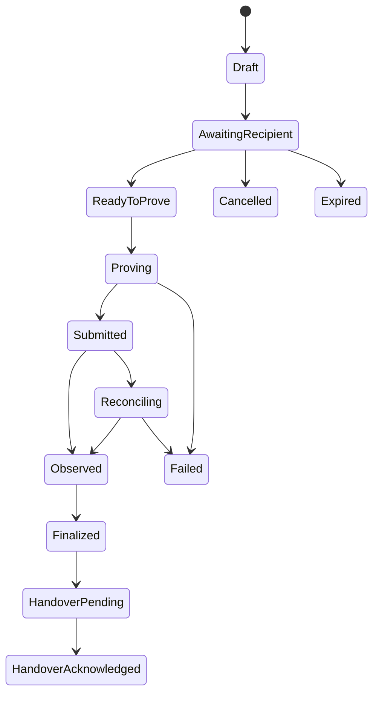

# 04 — Midnight, ownership, provenance and reprint

The product promise is meaningful possession with a continuing history. Midnight is the required privacy-preserving rights network in this design. The app must provide value before a wallet is connected, and it must describe precisely what a proof establishes.

## 1. Correct the baseline before adding features

The existing `brandme-chain/src/services/midnight-client.ts` is a stub. Strings beginning with `encrypted_`, invented transaction hashes, a constant proof value and a hardcoded confirmed block do not provide encryption, proof verification or settlement. The Python `ZKProofManager` hash/JSON behavior is also not a substitute for a Compact circuit. Keep any useful interface shape, replace the implementation, and prevent fake adapters from loading in sandbox or production.

The claim that no usable Midnight SDK exists is stale as of this specification. Official documentation lists Preview, Preprod and Mainnet, together with a supported stack. Mainnet access arrangements also changed immediately before this specification: Midnight-hosted mainnet RPC/indexer services were retired September 30, 2026, with Blockfrost the documented primary provider from October 1. Reverify these endpoints and access terms at implementation. [S01–S05]

### Compatibility baseline to verify and pin together

| Component | Documented version on 2026-10-05 |
|---|---|
| Ledger | 8.1.2 |
| Compact developer tools | 0.5.1 |
| Compact compiler/toolchain | 0.31.1 |
| Compact runtime | 0.16.0 |
| Compact JS | 2.5.1 |
| Platform JS | 2.2.4 |
| On-chain runtime | 3.0.0 |
| Wallet SDK | 1.2.0 |
| Midnight.js / testkit-js | 4.1.1 / 4.1.1 |
| DApp connector API | 4.0.1 |
| Proof server | 8.1.0 |
| Node | Preview 1.0.300; Preprod/Mainnet 1.0.400 |
| Indexer | Preview 4.3.5; Preprod/Mainnet 4.3.302 |

This is a dated compatibility snapshot, not permission to mix it with arbitrary future packages. Lock the compiler, circuit artifacts, runtime, node/prover and connector interfaces as a tested tuple. Record artifact hashes and the exact network. A contract compiled with one tuple is not silently served with another tuple's proving material. [S02]

Use Preprod for external integration acceptance. Preview is appropriate for deliberate compatibility experiments. Local undeployed contracts support deterministic tests. Mainnet exists, but the build must not deploy contracts, use real funds or transfer real assets without a separately authorized launch action.

## 2. What belongs on chain

| Data | Location | Reason |
|---|---|---|
| Name, email, public profile link | Application identity service; selective public profile only | Not required for a rights proof |
| Persona, body images, measurements, social graph | Encrypted/off-chain application stores | Editable, purpose-limited and deletable |
| Receipts, addresses, private manufacturing files | Restricted encrypted object storage | Sensitive and often contract-controlled |
| Product metadata permitted for public reuse | Versioned passport service/object storage | Correctable descriptions and accessible presentation |
| Issuer key/trust registry references | Contract and issuer registry | Determines which attestations can establish claims |
| Rights commitment, consumed nullifier, policy/version commitment | Midnight ledger as required by audited contract | Enforce the specific rights transition without publishing private payload |
| Ownership witness and private-state secrets | User-controlled encrypted private state; custody mode explicit | Needed for proof and recovery; not application analytics |
| Optional public batch provenance root | Cardano, only after real integration | Public timestamp/anchor, separate from Midnight settlement |

Do not put deterministic hashes of low-entropy names, sizes, addresses or emails on a public ledger and call them anonymous. Use scheme-appropriate domain separation and cryptographically random blinding where required. Commitment design needs protocol review. Privacy also depends on timing, issuer metadata, request logs, reused identifiers and network observations; a zero-knowledge circuit alone does not remove those links.

An ownership proof should answer a narrow question, such as “the authenticated holder can authorize transfer of this active entitlement under policy version 3.” It should not disclose the holder's entire closet, purchase history or personal identity unless the workflow explicitly needs it.

## 3. Provider architecture and custody

Implement the official provider boundaries: private state, public data, circuit configuration, proof generation, wallet, and transaction submission/network provider. Inject them by environment and capability; do not hide all six in a `fetch` returning a mock transaction. [S04, S06]

### User-controlled mode: initial rights default

The member connects a compatible wallet using the documented DApp connector. The app verifies network, account/session and connector capabilities. It requests only the access needed for the selected operation. It displays network and transaction purpose in ordinary language. The wallet provides signing/submission authority; the app does not ask the user to paste a seed phrase.

Private contract state is encrypted and account-scoped in the supported local storage mechanism. Encryption keys must not be a hardcoded password or a reusable global server secret. Implement locked/unlocked/account-changed states and erase decrypted in-memory state on lock/sign-out. A changed wallet must not inherit the previous wallet's private-state cache. Browser data clearing can lose local state: backup/recovery must be an explicit tested product flow before valuable rights are issued.

Provide an encrypted private-state backup export separate from the general profile export. Document what recovery material is needed and what a wallet seed alone does or does not restore for the chosen SDK. Test restore into a clean profile against the same network/contract. Do not claim “recoverable” because a JSON file was downloaded.

### Proof generation and the trust boundary

A prover can receive private witness inputs. Remote proving therefore exposes those inputs to that service unless an additional verified protocol prevents it. The initial privacy-preserving mode uses a locally controlled prover/companion where supported; an encrypted transport connection alone does not make a hosted prover blind. [S04]

On mobile, do not promise browser-local proving until the actual supported stack and resource use have been measured. The mobile app can show wardrobe/passport state and prepare operations. If the connected wallet/approved companion supports the proof flow, use it. Otherwise offer a clear “Complete this ownership action on your connected device” state with an expiring intent; the rest of the product stays usable. An optional managed prover requires a separate disclosure naming the operator and data exposure, plus explicit consent. No silent fallback from local to managed proving.

### Custodial mode: separate later capability

Managed custody is not a shortcut to hide wallet complexity in a global backend key. If introduced, it needs a distinct product mode, segregation of user keys/state, documented recovery policy, audited operational controls, approval limits and jurisdiction/provider review. Keep its types and UI different from user-controlled mode. An app login alone cannot pretend to be a self-custodied signature.

### Network configuration

Read wallet-selected configuration through the supported connector and compare it to the deployment's allowed network. Preprod documentation lists `https://rpc.preprod.midnight.network` and `https://indexer.preprod.midnight.network/api/v4/graphql`. Mainnet documentation lists `https://rpc.midnight-mainnet.blockfrost.io` and the Blockfrost indexer API. Use the current exact API paths/authentication after provider verification; do not guess headers or hardcode a token into a browser URL. [S03, S05]

Route secret-bearing provider requests through a constrained service adapter. Validate intended network/contract on every proof and operation. Prevent a Preprod receipt from being presented as Mainnet ownership. A test-network badge must remain visible in passport, wallet drawer, proof details and shared evidence.

## 4. Contract families and logical state

Use three bounded contract domains, which may share a deployed contract only after complexity analysis: issuer/attestation registry, transferable entitlement, and licensed reproduction. Start with the smallest circuits that enforce the invariants. Do not implement an entire social graph or recommendation engine in Compact.

### Logical types

The following are language-neutral requirements, not claimed compilable Compact syntax:

| Type | Required content |
|---|---|
| `IssuerPolicy` | Authorized issuer key reference, claim schemas, validity, revocation behavior, policy version |
| `AssetCommitment` | Randomized asset identifier binding, issuer, metadata digest, edition/serial policy |
| `Entitlement` | Asset/design commitment, right type, controller commitment, rights policy digest, epoch, status |
| `TransferOffer` | Entitlement reference, sender epoch, recipient commitment, nonce, expiry, terms digest |
| `ReprintAllowance` | Licensed design digest, authorized controller, remaining quota, territory/manufacturer constraints, validity, policy digest |
| `ConsumptionRecord` | Domain-separated unique nullifier, allowance reference, approved quantity, job commitment |
| `IssuerAttestation` | Typed claims digest, issuer authorization, subject binding, validity and revocation reference |

Minimize public linkability while preserving discoverability and synchronization required by the chosen SDK. The implementer must document the actual public/private field placement and how a new owner receives needed state. An abstract commitment is not enough if the recipient can never prove ownership after transfer.

### Circuit/transition requirements

| Logical operation | Preconditions | Postconditions |
|---|---|---|
| `registerIssuer` | Authorized registry governance; unique key/policy; documented rotation | Issuer policy active with version and audit event |
| `issueEntitlement` | Authorized issuer; valid asset/design binding; unique issuance ID | One active entitlement, initial epoch, recipient can restore/prove |
| `proveControl` | Valid active entitlement witness, challenge/audience, current policy | Minimal proof bound to challenge; no rights mutation |
| `offerTransfer` | Current controller; transferable right; unused nonce; current epoch | Bounded offer, or off-chain signed offer with equivalent verified checks |
| `acceptTransfer` | Authorized recipient; unexpired offer; sender control still valid; expected epoch | Old control consumed, new control established, epoch advanced exactly once |
| `cancelTransfer` | Authorized sender; unaccepted offer | Offer unusable; original entitlement remains active |
| `consumeReprintAllowance` | Valid licensed right, quota, approved manufacturer and quantity; unused job/nullifier | Quota decreases exactly once; consumption bound to one job |
| `attestManufacture` | Authorized manufacturer; referenced approved consumption; new serial/edition rules | Child asset attestation references parent design/license and job |
| `revokeOrRecover` | Explicit policy authority and evidence; applicable notice/delay; constrained scope | Policy-defined update with visible history; never hidden administrator rewrite |

Do not sign arbitrary claims as “verified.” The contract must enforce the relevant signature, membership, uniqueness and state rules inside the verifiable transition, using official primitives. A witness function that simply returns `true` is not authorization. A server `if` before an unconstrained circuit is not a cryptographic invariant.

### Mandatory invariants

1. At most one active controller for a unique transferable entitlement at a given epoch.
2. The same transfer offer cannot complete twice, including concurrent submissions.
3. A proof/approval for one network, contract, right, epoch or audience cannot be replayed in another.
4. The controller cannot issue additional rights beyond the issuer's policy.
5. A reprint consumes a bounded quota once; duplicate callbacks never increase it.
6. Revoked or expired issuer authority cannot mint new valid attestations under that authority.
7. Zero quota, negative quantity, overflows, malformed commitments and invalid witnesses fail deterministically.
8. A failed/unsubmitted proof does not advance application ownership or consume a production quota.
9. App projections cannot cause the contract state to become valid; the direction of evidence is chain observation to projection.
10. A privacy statement matches the actual public ledger and prover inputs, including metadata.

Use official testkit/simulator plus property tests for sequences and adversarial witnesses. Test real Preprod issue/prove/transfer/consume flows before claiming integration. Contract review must examine circuit constraints, witness behavior, private-state synchronization and recovery, not just TypeScript unit tests.

## 5. Transfer experience and state machine

The owner chooses the garment, reviews which rights move, selects a recipient through a private invite or compatible identity, and sees fees/network/conditions. The recipient accepts before a two-party transfer becomes final. A physical handover is a separate event and can remain pending after a digital right moves.

Application states:

Persist each operation before wallet interaction. The request digest includes network, contract, entitlement, epoch, recipient, rights policy, expiry and nonce. The UI must handle wallet denial, wrong network, expired intent, proof resource failure, disconnected tab, node timeout and delayed indexing. “Submitted” means a real submission identifier exists; it does not mean finalized. A timeout after submission enters reconciliation, not a new automatic transfer attempt.

Define network-specific finality policy using current documentation and observed indexer/node semantics. Do not invent a universal “six confirmations” rule. Persist block/transaction evidence and reconcile disagreements. While pending, prevent conflicting app commands and rely on contract invariants for ultimate double-spend protection. If the UI loses state, it reloads the persisted operation and queries real evidence.

After finality, the recipient gains the allowed passport/private-state access; the old owner loses transferable control. Historical personal notes and social photos do not automatically move. The transfer packet includes only agreed documents and rights. Revoke old share links that implied active ownership when appropriate, while preserving permitted historical provenance. The app may keep an “Previously owned” private memory without claiming current possession.

For goods bought from an ordinary retailer without an issuer-integrated entitlement, record a receipt-backed claim at its actual assurance level. Do not mint an issuer-verified garment passport just because the user scanned a barcode or paid for it. The upgrade path is an issuer or approved authenticator attestation.

## 6. Physical identity and provenance

Use a layered claim model:

| Evidence | What it can support | What it cannot establish by itself |
|---|---|---|
| Member-entered item/photo | Personal wardrobe record | Authenticity, legal title or issuer approval |
| Merchant order/receipt | A documented purchase relationship | Current possession or absence of return/resale |
| Static QR/barcode | Identifier lookup | Resistance to copying |
| Secure NFC verification | A successful tag-authentication event under the issuer's provisioning policy | That a tag has never been moved to another garment |
| Authorized inspection | Inspector's scoped authenticity/condition claim | Every future lifecycle event |
| Midnight control proof | Control of the specified active digital entitlement | Physical possession, fit or copyright ownership |
| Manufacturer attestation | Claimed production event by named manufacturer | Independent truth unless separately audited |

For an NTAG 424 DNA integration, use the manufacturer's documented secure messaging/authentication design and reviewed implementation. Provision per-tag diversified secrets through an authorized process; keep master material out of mobile/web code; verify freshness/replay properties and retain safe counters/evidence. A plain NFC UID is not a secret. Secure attachment/tamper policy and issuer reconciliation remain necessary. Browser Web NFC availability is not universal; allow an OS-opened secure URL and appropriate native companion path. Do not invent browser access to tag cryptographic keys. [S27]

The scan page shows separate statements: product identified, tag verified, issuer recognized, entitlement controlled, ownership claim reviewed, lifecycle attested. Each statement has source, time, environment, expiration/revocation status and “What this means.” Avoid a single green shield that collapses all claims into authenticity.

### Passport facets and disclosure

Preserve the repository's seven logical facets: product details, provenance, ownership, social layer, ESG impact, lifecycle, molecular data. A visual six-sided cube can provide a seventh expandable panel; data architecture must not change to fit a decorative object.

Public product information and authorized attestations can be shared. Ownership identity, social details and molecular/manufacturing intellectual property default private. Each facet is filtered on the server, including nested fields and top-level owner references. ESG values are claims with issuer, method, unit, boundaries, date and uncertainty. Never reuse the stub's invented savings/recovery percentages as verified facts.

Support structured identifiers and resolver links compatible with GS1 Digital Link where the issuer supplies legitimate identifiers. Do not fabricate GTINs or call any arbitrary URL GS1 compliant. Export a versioned machine-readable passport with claim provenance and access controls. Blockchain use alone does not establish EU Digital Product Passport compliance; applicable product requirements depend on the relevant rules and delegated measures. Maintain a compliance mapping separately and have the applicable obligations reviewed before making a compliance claim. [S21, S22]

## 7. Licensed reproduction and circular manufacture

Reprinting means creating another physical instance from an authorized design or manufacturing definition. Ownership of the original physical item does not automatically grant this right. A digital license may allow display only, transfer, personal manufacture, repair parts, commercial reproduction, or none of these. Represent each permission explicitly.

A product can show “Request reprint” only when the capability registry confirms all of: rights holder license, valid controller entitlement, remaining quota, supported manufacturing process, authorized manufacturer, permitted territory, available manufacturing files and a valid material/quality specification. Otherwise explain the missing condition. A normal photograph or approximate 3D preview is not a manufacturing pattern.

### Workflow

1. **Eligibility:** Resolve design/version, license policy, holder control, quota and manufacturer capability. Do not consume quota during browsing.
2. **Specification:** Choose allowed size/material/color modifications. Require a new rights approval if the requested derivative falls outside the license. Keep calibrated production patterns separate from visualization assets.
3. **Quote:** Manufacturer returns price, shipping, lead time, tolerances, material specification, warranty/return terms, rights conditions and expiration. The user approves the exact quote through the commerce flow.
4. **Reservation:** Reserve the job and any app-side allowance; reserve payment authorization only through supported payment rails. A reservation is not manufacture or final quota consumption.
5. **Entitlement consumption:** Prove and record the approved bounded right consumption. Bind the nullifier to the job and design. Apply the contract's actual ordering relative to payment, with compensating states for failure.
6. **Production acceptance:** Manufacturer acknowledges the job and authorized file access. Download access is scoped, expiring and logged. Do not expose proprietary patterns in a public GLB.
7. **Production evidence:** Manufacturer supplies signed evidence of the produced instance, serial, materials, quality checks and relevant certificates. The app verifies issuer authorization and schema; it does not infer truth from a successful upload.
8. **Child passport:** Issue a new instance linked to the design/license and permitted parent history. The original item remains unless a separate authenticated destructive lifecycle occurred.
9. **Delivery and care:** Track shipping, receipt, warranty, repair and eventual lifecycle. Add to “On the way” first; move to owned through the documented receipt flow.

### Failure and dispute policy

Use states `eligibility_check`, `quoted`, `approved`, `reserved`, `rights_consuming`, `rights_consumed`, `accepted`, `manufacturing`, `quality_review`, `shipped`, `delivered`, `cancel_requested`, `cancelled`, `failed`, `disputed`. Keep payment state separate. A payment failure after rights consumption does not justify deleting the chain event. Resolve by an explicit policy-authorized replacement allowance or compensating grant, with a unique reference to the failed job and checks against later fulfillment.

If manufacture fails or is cancelled, a rights holder may issue a replacement allowance under its policy. Never automatically restore quota from an untrusted webhook. If an item is dissolved/recycled, a digital burn only proves a digital transition; physical destruction/material recovery requires a named processor's evidence and, where needed, independent verification. Do not promise atomic coupling between physical destruction and blockchain finality.

Material lineage can be many-to-many: multiple inputs into one batch and one batch into multiple items. Track quantities, units, process losses, measurement uncertainty and evidence. A parent-child pointer alone is insufficient for mass balance. Record what is measured, estimated or unverified. Circular-economy claims must not be generated by a constant `0.85` recovery factor.

## 8. Cardano and other identity layers

Keep Cardano support as an optional public provenance-anchor adapter because it is part of the repository history. Midnight is the required private rights network in the founder's current request. Do not make a consumer purchase wait for two chains without a real reason.

If public anchoring is enabled, batch only approved non-personal commitments. Track Midnight settlement and Cardano anchoring as independent statuses. A hash combining two transaction IDs is not a cross-chain proof or atomic bridge. No bridge should be described as verified without an actual protocol, independent validation and failure/reorganization handling. Ordinary merchant payment can remain on the merchant's existing rail; provenance does not require inventing a Midnight payment settlement system.

DIDs, verifiable credentials or third-party identity services may be adapters for specific partner requirements. Do not install every technology mentioned in old plans. Select a credential format only with an explicit issuer/verifier flow and conformance evidence; never equate a DID with verified personhood. Keep member login, public handle, wallet controller and licensed legal identity distinct.

## 9. Release evidence

The integration report must contain sanitized actual contract addresses, network, compiler/runtime tuple, artifact hashes, issue/transfer/reprint-consumption transaction identifiers, observation/finality evidence, test account recovery steps and the outcomes of replay/concurrency tests. It must state who can see witness inputs in each proving mode.

The UI acceptance video must show: a non-wallet member enjoying the closet; connecting a wallet later; rejecting a wrong-network operation; a real Preprod entitlement being issued and transferred; refreshing during submission and recovering state; a failed proof not changing ownership; a consumed reproduction allowance refusing reuse; and a passport distinguishing physical evidence from digital control. If any external capability is unavailable, the final build report names the blocked gate and shows the honest unavailable UI. It must not replace the missing evidence with a green badge.
