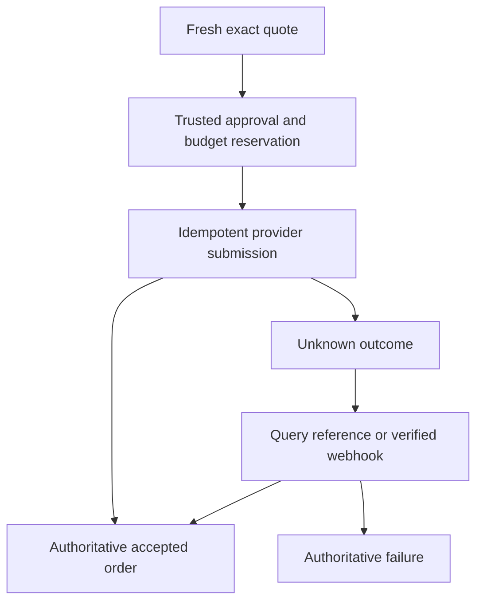

# 05 — Commerce, agents and authorized data connectors

Brand.Me should help a person discover, compare, ask friends, try a look, buy when ready, and bring the item into their continuing wardrobe. The assistant is useful before it can purchase. Each connector advertises the capabilities it actually has in the current environment and account.

## 1. Capability-first connector design

The provider registry is server-owned and versioned. Each connection declares provider ID, operator account, environment, geography, contract/access status, credential reference, enabled capabilities, protocol/version, data-use rights, retention policy, rate limits, last verification, health and safe handoff URL. The browser receives a sanitized effective-capability DTO, never credentials or commercial contract details.

Use these capability names consistently: `catalog.search`, `catalog.detail`, `catalog.feed`, `catalog.images`, `catalog.3d`, `inventory.read`, `price.quote`, `cart.create`, `cart.update`, `checkout.handoff`, `checkout.submit`, `orders.read`, `orders.webhook`, `returns.request`, `refunds.read`, `affiliate.attribution`, `receipts.import`, `tryon.photo`, `tryon.live`, `rights.issue`, `rights.transfer`, `rights.reprint`, `manufacture.quote`, `manufacture.submit`.

Each capability is `unconfigured`, `sandbox`, `verified`, `degraded`, `suspended` or `unsupported`, with reason and last checked time. “Configured” is not “verified.” A health check that only reaches a host does not verify order placement, feed rights or return support. Effective availability is the intersection of provider capability, user consent, geography, authentication, device support, product support and operation policy.

### Adapter interface requirements

Implement narrow typed interfaces: `CatalogProvider`, `InventoryProvider`, `CartProvider`, `CheckoutProvider`, `OrderProvider`, `ReceiptImporter`, `TryOnProvider`, `RightsIssuer`, `ManufacturingProvider`, `ContextProvider`. A provider may implement one or several. Avoid a giant class whose unsupported methods return success-shaped empty objects.

Common results carry `provider`, `environment`, `operation_id`, `source_reference`, `observed_at`, `expires_at`, `status`, `warnings` and normalized typed data. Errors distinguish unsupported, not configured, unauthorized, contract restricted, throttled, transient, malformed provider response and outcome unknown. Preserve a redacted provider evidence reference for debugging. A provider-specific field belongs in a versioned extension, not an untyped bag used throughout the UI.

No adapter can silently change from live to demo. Dependency injection selects a provider mode at startup; production boot rejects simulation implementations in commerce, rewards, claims and chain modules. An operator may suspend a live capability and expose a truthful handoff. It may not make the same button appear successful against a fixture.

## 2. Nordstrom: concrete supported path

Nordstrom's official affiliate page currently directs publishers through Impact and separately presents its creator program. This review did not establish a generally available public Nordstrom checkout API. Therefore the initial Nordstrom integration is an authorized publisher/catalog/deep-link integration, with any feed or richer API access contingent on the actual partner account and agreement. Do not build against a guessed `api.nordstrom.com` endpoint or treat a retailer page scraper as a licensed catalog. [S14]

### Three explicit levels

| Level | What Brand.Me can implement | Required evidence |
|---|---|---|
| Link-only | Member saves an allowed product URL; Brand.Me opens the retailer for checkout; optional user-entered metadata | URL validation, allowed metadata source and clear external checkout |
| Approved publisher | Authorized feed/catalog data, approved imagery, affiliate links and attribution | Nordstrom/Impact approval, enabled catalog, permitted fields/assets and working account credentials |
| Contracted commerce | Live inventory, cart/order/returns operations only if separately provided | Actual contractual API access, official endpoint/schema and sandbox/production conformance |

The user-visible CTA for a link/publisher integration is “Continue at Nordstrom.” It is not “Bought by your agent.” A click or affiliate event does not prove an order was placed. After external checkout, offer a receipt import or supported authorized order sync. Show “Purchase not yet confirmed” until appropriate evidence arrives.

### Operator setup flow

1. Console → Providers → Nordstrom → choose authorized access level.
2. Open the official program application in a new tab; show a setup checklist and leave the connection unconfigured until approved. Do not automatically apply on behalf of the company.
3. Store approved account/catalog references and credentials through the secret-entry service. Secret fields are write-only; subsequent displays show a masked identifier and last rotation time.
4. Use current Impact partner documentation to discover the account's available catalogs and field schemas. Confirm permission to display/cache images, transform them, retain prices, use affiliate tracking and create derived 3D/AI representations. Do not assume feed access grants all those rights. [S15]
5. Run a read-only test: fetch a bounded page, normalize variants, verify merchant identity and deep-link destination, and display a data-use summary.
6. Run staging ingestion and inspect example records. Require an operator to mark contractual rights and geographic availability before enabling the capability.
7. Enable scheduled incremental refresh with cursors, rate-limit handling and stale-data rules. Keep an ingestion audit with accepted/rejected counts and schema changes.

Do not copy account IDs, secret keys or private merchant contracts into repository fixtures or screenshots. Documentation should list configuration names and acquisition steps, not fabricated credentials.

### Ingestion normalization

Map source product ID, source variant/SKU, merchant, brand, title, description, category, size label/system, color, GTIN where legitimately supplied, product URL, approved image URLs, price/currency, availability, source update time and rights policy. Store the original source reference and normalized revision. Distinguish product-level price ranges from purchasable variant quotes.

Deduplicate within `(provider, merchant, source_product_id, source_variant_id)`. Cross-provider product matching is a separate reviewed identity link with confidence; do not collapse different variants because their names look similar. A $100 “from” price cannot be shown as a confirmed price for a selected size. Ingest tombstones/discontinued records and invalidate unsupported offers.

Default freshness targets are catalog descriptive data within 24 hours, displayed availability within 15 minutes when supported, and a new price/inventory check immediately before an in-app purchase. These are internal targets subject to the provider's actual contract/rate limits. When revalidation is unavailable, show the last checked time and hand off for final retailer confirmation. Never promise stock from a daily feed.

Affiliate disclosures appear near commercial links, and affiliate eligibility must not secretly determine the member's style match. Record attribution according to the provider agreement and user privacy choices. A refund or cancelled order must reverse any provisional reward/commission treatment when the applicable evidence arrives.

## 3. Shopify and UCP

Use authorized Shopify catalog and agent commerce capabilities where a merchant actually supports them. The documented agent path separates catalog discovery, cart operations, checkout and a continuation URL. Merchant capability/profile discovery and required authentication determine what is available. A cart update may replace the entire cart; normalize this behavior inside the adapter and protect it with revision checks. Different merchants produce separate checkouts. [S16]

Implement a `ShopifyUcpAdapter` with verified protocol/profile version and capabilities. The onboarding console accepts an approved merchant/profile reference, verifies the discovery document and trusted destinations, negotiates supported operations and runs conformance fixtures. Cache capabilities briefly with version and expiry; a removed payment method or expired permission invalidates pending quotes.

A hosted `continue_url` is a supported completion path, not an error. Persist the cart/checkout reference, open the verified destination, and reconcile the result through an authorized order channel. Do not mark an order completed when the browser opens or returns from that URL. Prevent open redirects by validating provider-issued destinations against registered merchant domains and signed/reference-bound state.

Do not assume Nordstrom uses Shopify or that Shopify access grants access to any other retailer. A protocol describes interaction; it does not create a commercial relationship.

## 4. ACP, AP2, MCP and A2A roles

| Protocol | Role in Brand.Me | What it does not supply automatically |
|---|---|---|
| ACP | Compatible checkout/session and delegated payment integration where supported | Merchant access, a working payment processor or proof that an order completed |
| AP2 | Verifiable authorization binding among user, checkout and payment under the supported version | General permission for an LLM to spend or arbitrary agent-to-agent redelegation |
| MCP | Authenticated typed tools for authorized external assistants and provider services | User identity from an untrusted `user_id` argument or permission from tool discovery |
| A2A | Discovery and task coordination between approved agents where needed | Purchase consent, payment settlement or automatic trust in another agent |
| UCP | Merchant capability negotiation and supported commerce operations | Universal catalog/checkout access across all retailers |

### Correct the old AP2 plan

The repository's older plan describes Intent, Cart and Payment mandates. The current AP2 v0.2 specification reviewed for this document instead centers on **Checkout and Payment mandates**, trusted surfaces and defined supported flows. Keep Brand.Me's `ShoppingIntent` as an internal planning object. Do not label its UUID an AP2 mandate or carry the old three-mandate schema into a new adapter without explicit version support. The reviewed specification places agent-to-agent delegation outside its current scope. [S18]

Implement a versioned AP2 codec using exact official schemas, signing requirements, claim validation, trust/key discovery, expiry and conformance tests. Do not hand-design a vaguely similar JSON object and claim compatibility. In particular, do not assume the repository's wallet/CIP-30 signing scheme is valid for every AP2 signature requirement. Preserve protocol payloads and normalized internal authorization separately, with a verified mapping and payload hash.

Use the AP2 trusted-surface concept for the authorization UI: deterministic code renders verified checkout terms and obtains consent outside the agent's free-form prose. The agent may propose a purchase; it cannot manufacture the user interaction or rewrite signed terms. Support open/autonomous authorization only after a provider and the implemented AP2 version support it and the bounded policy is tested. Human approval for each purchase is the initial default.

### ACP adapter

Implement the current official checkout/payment schema through a versioned adapter and conformance fixtures. Preserve checkout/session IDs, supported payment mechanisms, update/cancel/complete semantics and provider errors. Payment tokens are scoped to the supported payee/amount/purpose and are not raw payment credentials exposed to an LLM. A successful local `checkout.complete` handler is not sufficient; the merchant's authoritative result and subsequent reconciliation determine the order state. [S17]

### MCP surface

Use the current MCP authorization specification and protected-resource discovery for remote HTTP access. Validate audience-bound tokens and client authorization; never pass one provider's bearer token through to another arbitrary service. Bind all tool calls to the authenticated principal and delegation, and enforce object-level policy inside the tool executor. Pin the protocol version and run interoperability tests. [S20]

Proposed Brand.Me tools:

| Tool | Mutation/approval behavior |
|---|---|
| `brandme.persona.read` | Read allowed effective profile and reasons; no raw evidence without scope |
| `brandme.persona.propose_update` | Produces a member-reviewable proposal; ordinary agents cannot silently rewrite identity |
| `brandme.wardrobe.search` | Read permitted wardrobe records and fidelity/claim labels |
| `brandme.outfits.suggest` | Returns persisted draft proposals with actual item references |
| `brandme.catalog.search` | Authorized providers with source/freshness/disclosure |
| `brandme.cart.create` / `brandme.cart.update` | Draft only, principal-bound and idempotent |
| `brandme.checkout.quote` | Fresh terms; no purchase |
| `brandme.purchase.request` | Creates approval request; cannot approve itself |
| `brandme.purchase.execute` | Requires valid bound approval, policy and provider capability |
| `brandme.order.status` | Provider-observed status with last checked time |
| `brandme.social.request_decision` | Requires separate explicit communication authority and audience preview |
| `brandme.rights.transfer_request` | Creates rights intent; wallet/recipient workflow still required |
| `brandme.reprint.quote` | Eligibility and quote; does not consume a license |
| `brandme.reprint.request` | Requires manufacturing, rights and purchase approvals |

Compatibility aliases can preserve existing tool names, but the old fake implementations must be retired. `ap2.create_intent_mandate`, for example, must not continue to advertise current AP2 compliance if it only creates an internal intent. Return a documented version/unsupported response or migrate callers explicitly.

### A2A

Implement A2A only for a concrete approved partner/task need. Pin the official current version, publish a truthful Agent Card containing actual supported skills and authentication requirements, and use the current specified endpoints rather than copying unverified paths from the old plan. Sanitize task messages, enforce expiry/cancellation and bind a partner task to a local delegation. A discovered agent is untrusted until identity, capability and authorization checks pass. [S19]

## 5. Agent purchase authority

Offer three modes: **Research for me**, **Prepare my purchase**, and **Buy within my rules**. The first two are available before autonomous purchasing. The third appears only for a verified capable provider and an explicit bounded grant. Default new connections to research.

The grant editor displays allowed merchant(s), exact categories or product/variant constraints, maximum amount per order, cumulative amount in a rolling period, currency, end time, allowed delivery address reference, returnability requirements, substitution policy, allowed payment instrument reference, notification method and whether final human approval is required. Default substitution is none; default no subscriptions, gift cards, restricted goods or recurring charges. These defaults concern this fashion-shopping scope and can only expand through a separately designed policy.

“Under $200” must specify whether that includes tax and shipping. Brand.Me uses all-in total by default. Currency changes require new approval; no implicit FX conversion inside authorization. Available budget includes reservations for in-flight orders so two agents cannot each spend the same remaining allowance. Reserve/consume/release budget transactionally with the purchase operation. Refund credit-back follows the configured grant policy and verified refund evidence.

The agent runtime cannot approve its own request, edit a previously signed quote, impersonate a trusted-surface click or extend its expiry. Delegation revocation cancels unsent work immediately and reconciles already submitted operations. It cannot undo a merchant order already accepted; offer the actual cancellation/return path.

### Exact quote binding

Canonicalize the normalized quote with an established deterministic JSON encoding and versioned hash domain. Include at minimum: environment, provider, merchant/payee identifier, cart ID/revision, each exact variant and quantity, line prices, discounts, tax, shipping, all-in total, currency, delivery choice/address reference, return/recurrence terms digest, quote expiry and checkout reference. Hashing a cart ID alone is insufficient.

An approval adds principal, client/delegation, quote hash, nonce, amount/currency limits, issue/expiry, assurance level and authorization method. Use a server-verified trusted surface or conforming protocol credential, with reauthentication when policy requires it. A boolean sent from the browser such as `approved: true` is not proof that the bound user authorized the exact purchase.

If price, size, quantity, merchant, delivery, payment terms or material return conditions change, the approval becomes invalid and the user sees a new comparison. Harmless display text changes need not force reapproval if the canonical material terms are unchanged. Record the schema/rule deciding materiality.

## 6. Purchase state machine and reconciliation

Keep order, payment and fulfillment states distinct. Minimum purchase operation states are `draft`, `quoting`, `awaiting_approval`, `approved`, `submitting`, `outcome_unknown`, `accepted`, `rejected`, `cancel_requested`, `cancelled`, `partially_fulfilled`, `fulfilled`, `return_requested`, `partially_refunded`, `refunded`, `disputed`. A payment may be authorized while an order is not yet accepted, or refunded while a shipment remains in transit.

Persist the submission intent and provider idempotency key before network I/O. Where a provider supports idempotency, reuse the same key for the same operation. Where it does not, use documented lookup/reconciliation and avoid unsafe automatic retries. A timeout after request transmission goes to `outcome_unknown`. Show “We are checking whether the retailer accepted this order” and prevent another accidental purchase of the same intent.

Webhook processing verifies the provider's current signature scheme, checks timestamp/replay policy, stores the event ID, and applies monotonic/provider-appropriate state transitions. Do not assume events arrive in order. Query the source when an event contradicts known state. A webhook saying `paid` is not equivalent to `delivered`; a return request is not a refund.

On accepted order, create “On the way” wardrobe entries linked to exact lines and acquisition evidence. On delivery/receipt, offer to move them into the chosen closet with the placement animation. The member may acknowledge arrival; that action means member-reported possession, not issuer-authenticated ownership. Partial shipment, cancellation, return and exchange update the correct quantities and entries. Exchanges create a new variant relationship and retain the original history.

Payment processing remains with approved merchants/payment providers. Do not collect PAN/CVV in Brand.Me chat, tool arguments, logs or application forms. Do not claim that Midnight settles ordinary retailer payments unless a specific integrated rail actually does so. Privacy-preserving provenance and merchant payment are separate capabilities.

## 7. Other data providers and inputs

| Input/provider class | Initial behavior | Permission/data boundary |
|---|---|---|
| Manual item/photo | Always available with persistent member-owned record | Upload rights, private default, processed-media labels |
| Receipt file | User selects a file; structured extraction with editable draft | Receipt may contain address/payment fragments; redact/minimize and retain by choice |
| Email receipts | Later explicit mailbox provider integration with narrow scope and filters | No broad mailbox ingestion by default; permission to read does not authorize sending |
| Brand/retailer catalog | Approved API/feed or operator import with rights manifest | Field/image/derivative rights and refresh limits enforced |
| Creator/editorial runway content | Licensed or creator-submitted collections, attributed motifs | Public availability is not blanket permission to copy images or train models |
| Weather | Approximate location supplied by user or permissioned device; cache by area/time | No background precise location requirement |
| Calendar/occasion | Manual occasion first; optional narrowly scoped selected events | Do not copy attendee lists or private event descriptions into social shares |
| Size/fit provider | Optional approved per-brand measurements and fit evidence | Separate body-data consent; confidence and limitations visible |
| Repair/authentication partner | Verified organization, scoped service requests and attestations | Service quote/claim authority is explicit |
| Manufacturer/recycling partner | Capability and license-bound quote/job API | Proprietary designs, material evidence and operational status remain scoped |
| External shopping agent | OAuth/MCP tool access through explicit delegation | Per-user scopes and purchase/communication authority |

A URL importer must reject private-network, loopback, metadata-service and unsupported schemes, revalidate redirects and content type, limit download size/time and sandbox parsing. Do not allow arbitrary server-side browsing under the guise of a product image. Sanitize HTML and strip executable content from imported files. Treat model-extracted fields as suggestions until validated against source evidence and typed constraints.

For brand collections and trends, preserve source date, season, creator, license and editorial rationale. Extract allowed color/material/silhouette attributes with confidence and human correction. A “trend signal” is not evidence that a user should change who they are. Personal goals and explicit dislikes retain priority.

## 8. Provider setup and operator experience

Build console pages `/providers`, `/providers/{id}`, `/providers/{id}/setup`, `/providers/{id}/health`, `/ingestion`, `/commerce/operations`, `/chain/operations`, `/rights/issuers` and `/manufacturing/jobs`. Access requires operator roles; none are exposed through consumer navigation.

Each setup page has six sections: what this enables, access prerequisites, credential inputs, permitted data use, connection tests and activation. Show missing prerequisites as actionable rows. Save partial setup without enabling the capability. A test result includes time, environment, exact capability and sanitized evidence. “Connect” cannot be a button that only changes a local boolean.

Configuration inventory includes `BRANDME_MODE`, OIDC issuer/audience/client configuration, Spanner project/instance/database, Firestore project, object buckets, task/pubsub adapter settings, provider secret references, allowed redirect origins, Impact account/catalog references, UCP profile references, ACP/AP2 protocol versions, Midnight network/provider/contract/artifact references, prover mode, AI provider/model/region, notification provider and operational budget limits. Browser-exposed variables are a small allowlist containing only non-secret public configuration.

Implement health degradation separately for catalog, price, checkout, order sync and media rights. An order-sync outage must not erase a placed order. A catalog outage should show permitted cached items with timestamps and preserve personal closet functionality. A manufacturing outage disables new jobs while keeping existing job history and support access.

## 9. Notifications, sharing and communication authority

Preparing a message or share card is separate from sending it. In-app friend decisions require the member to choose/confirm the audience; external email, SMS, social posting and contact invitations require the relevant explicit action or previously granted bounded authority. An agent's shopping scope does not authorize it to message the member's contacts.

Start with in-app notifications and the operating system's share sheet. Email/push require verified provider setup, member opt-in, frequency controls, unsubscribe/preferences and secure notification deep links. Notification text cannot expose private garment value, body data, addresses or ownership proof details on a lock screen by default. Revoked/expired share links resolve to a neutral unavailable page, not cached private content.

## 10. Required connector evidence

For every provider, the build report must list supported operations, configured environment, access prerequisites, data-use rights, test evidence, known limitations and handoff behavior. At least one deterministic local commerce provider must cover success, stock loss, price increase, rejected authorization, timeout-after-acceptance, duplicate webhook, partial fulfillment and refund. Those fixtures prove application behavior, not a live retailer relationship.

A real provider integration is verified only after authorized sandbox or production evidence for the claimed capability. It is acceptable for Nordstrom to be publisher/deep-link only while a separate approved merchant supports agent checkout. It is unacceptable to hide that distinction from the user or the completion report.
